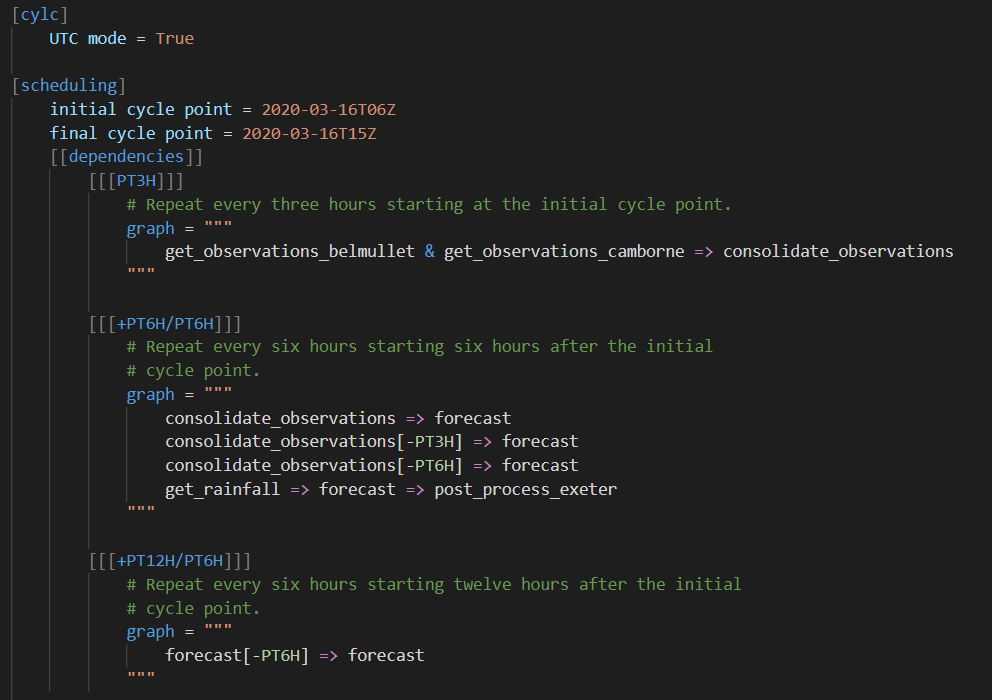

# vscode-cylc

A Visual Studio Code extension that provides language support for Cylc workflow configuration files.

## Features

- Syntax highlighting:
  - Cylc 7
  - Cylc 8
  - Jinja2 (can be used with a Jinja extension e.g. [Better Jinja](https://marketplace.visualstudio.com/items?itemName=samuelcolvin.jinjahtml))
- Snippets for Cylc 8 sections/settings

### Screenshot



## Installation

Either:
- In VSCode, go to `View > Extensions` and search for "Cylc"
- Or install from the [Visual Studio Marketplace](https://marketplace.visualstudio.com/items?itemName=cylc.vscode-cylc)

## Issues

Please report any syntax highlighting issues at [cylc/cylc-textmate-grammar](https://github.com/cylc/cylc-textmate-grammar/issues). Any other issues with the extension should be reported [here](https://github.com/cylc/vscode-cylc/issues).

## Contributing

### Syntax highlighting

This repo includes the [cylc/cylc-textmate-grammar](https://github.com/cylc/cylc-textmate-grammar) repo as a git submodule in the `/syntaxes/` directory. If you don't have experience with submodules, you should [read the docs](https://git-scm.com/book/en/v2/Git-Tools-Submodules) first.

The cylc-textmate-grammar repo contains a JSON TextMate grammar file which is used by VSCode for syntax highlighting. Read the [VSCode syntax highlight guide](https://code.visualstudio.com/api/language-extensions/syntax-highlight-guide) for more information.

> [!IMPORTANT]
> Do not edit the JSON file when contributing; instead you should edit the JavaScript grammar file and build it, as explained in the [contributing](https://github.com/cylc/cylc-textmate-grammar#contributing) section of cylc-texmate-grammar.

To install a development version of this extension:
```
git clone --recurse-submodules https://github.com/cylc/vscode-cylc.git
```
The `--recurse-submodules` option automatically initialises the cylc-textmate-grammar repo in the `/syntaxes` directory.

Run/debug the development version in a new window by pressing <kbd>F5</kbd>.

You can then edit the `/syntaxes/src/cylc.tmLanguage.js` grammar file. First, [read the contributing section](https://github.com/cylc/cylc-textmate-grammar#contributing) of the cylc-textmate-grammar repo - any such edits will be part of that repo as opposed to this vscode-cylc repo. After editing & saving the file, there is a build shortcut task (in `/.vscode/tasks.json`) which can be triggered by <kbd>Ctrl</kbd>+<kbd>Shift</kbd>+<kbd>B</kbd>. This will run the cylc-textmate-grammar build script which compiles the JSON grammar file. Reload the debugging window using the button on the toolbar or <kbd>Ctrl</kbd>+<kbd>Shift</kbd>+<kbd>F5</kbd>

> [!NOTE]
> Contributions to VSCode-specific features, e.g. bracket matching or snippets, are to be made in this repo, not the submodule.

### Snippets

Snippets are simply generated from the Cylc 8 workflow configuration spec by running:

```
./bin/build_snippets.py
```

or using the VSCode build task (<kbd>Ctrl</kbd>+<kbd>Shift</kbd>+<kbd>B</kbd>).

The latest version of cylc-flow should be installed for this to work.
